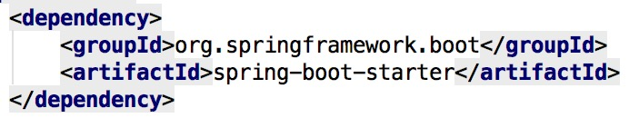
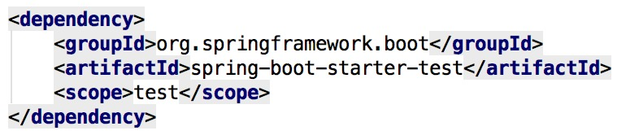
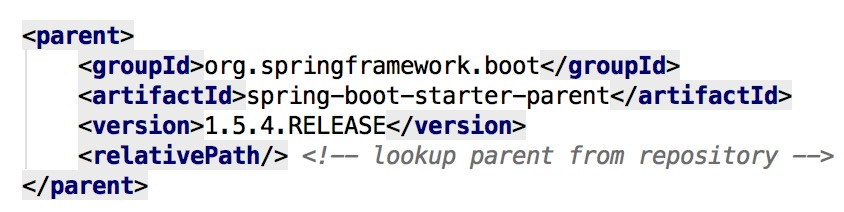
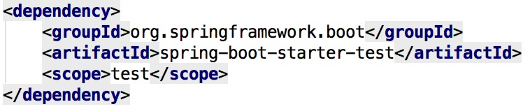
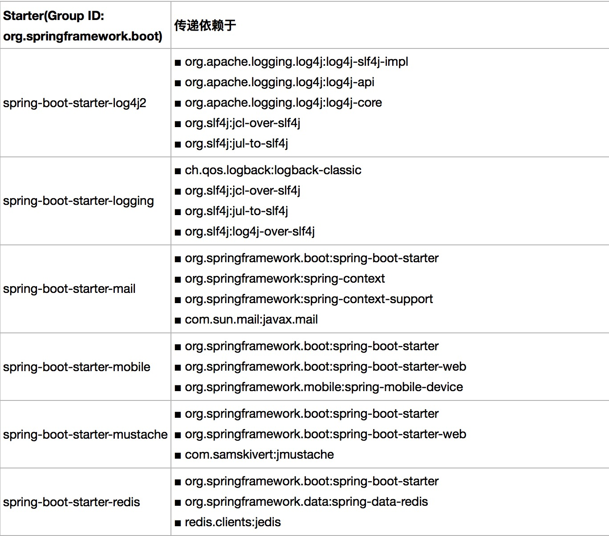
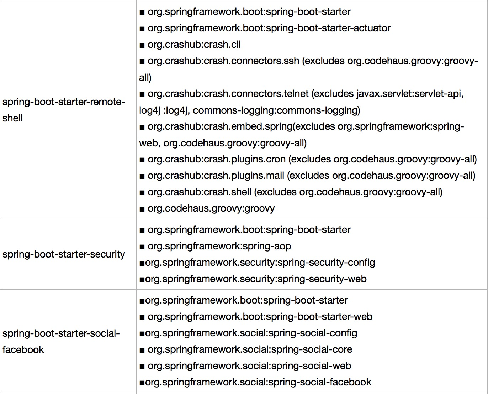
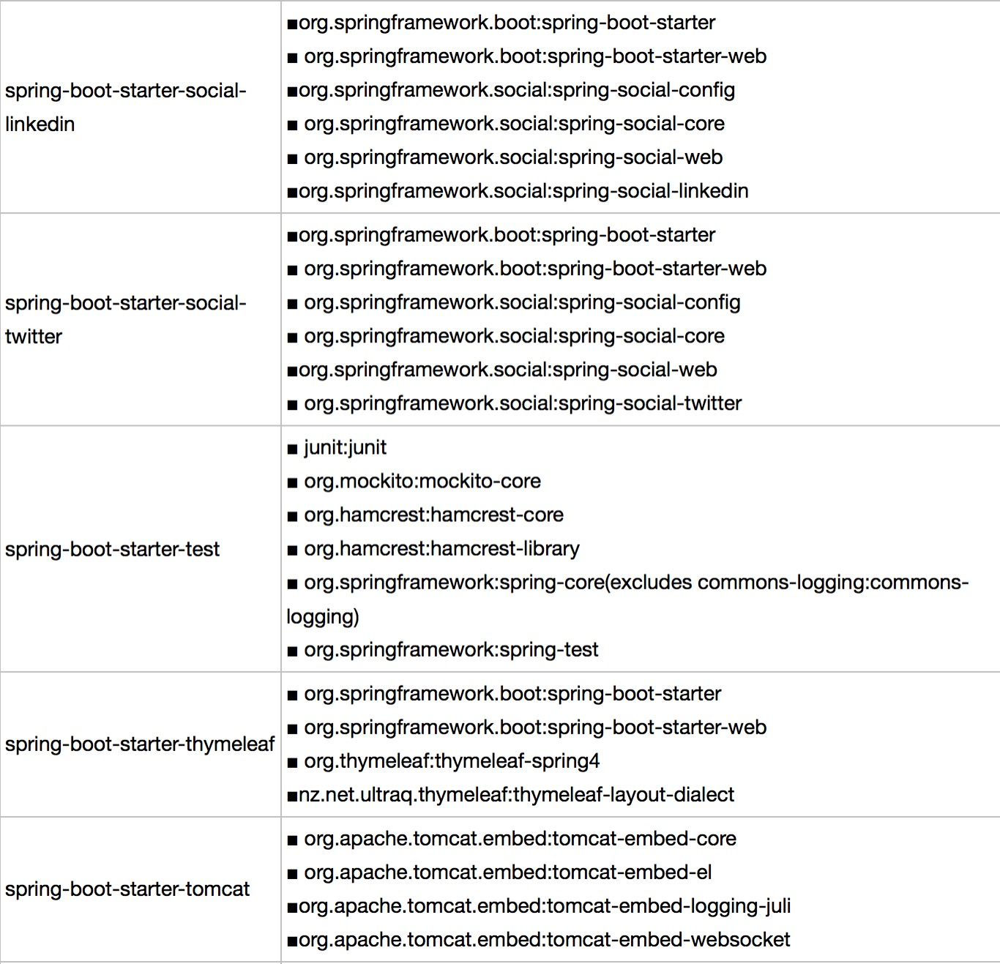
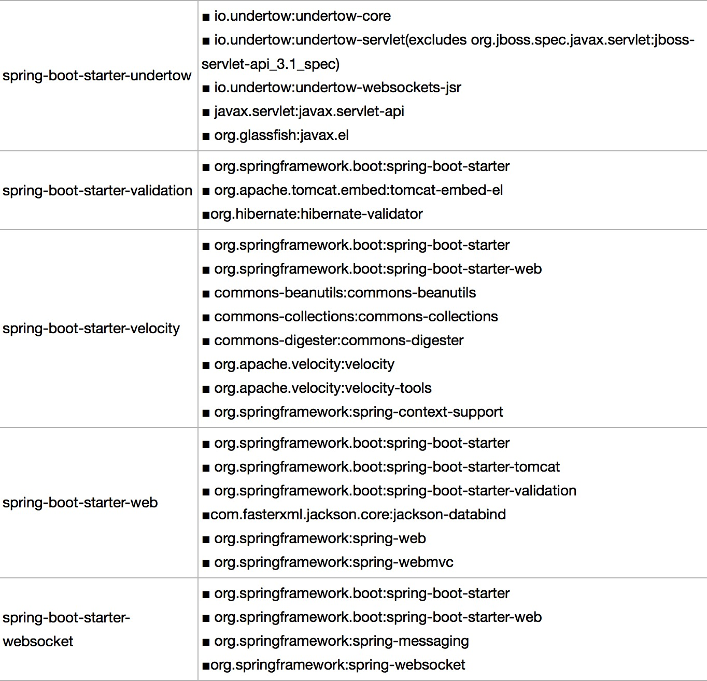

# 前言 #

+ [Spring Boot的启动器Starter详解](http://blog.csdn.net/chszs/article/details/50610474)
+ [Intro to Spring Boot Starters](http://www.baeldung.com/spring-boot-starters)
+ [Spring Boot中Starter是什么](https://www.cnblogs.com/EasonJim/p/7615801.html)
+ [Spring Boot的自动配置、Command-line Runner](https://www.jianshu.com/p/846bb2d26ff8)
+ [Spring Boot：定制自己的starter](Spring Boot：定制自己的starter)

# Spring Boot的启动器详解 #

+ spring-boot-starter

  Spring Boot的核心启动器，包含了自动配置、日志和YAML

  


+ spring-boot-starter-actuator

  帮助监控和管理应用

+ spring-boot-starter-amqp

  通过spring-rabbit来支持AMQP协议（Advanced Message Queuing Protocol）

+ spring-boot-starter-aop

  支持面向方面的编程（即AOP），包括 spring-aop 和 AspectJ

+ spring-boot-starter-artemis

  通过 Apache Artemis 支持 JMS 的 API（Java Message Service API）

+ spring-boot-starter-batch

  支持 Spring Batch，包括HSQLDB数据库

+ spring-boot-starter-cache

  支持 Spring 的缓存抽象

+ spring-boot-starter-cloud-connectors

  支持 Spring Cloud Connectors，简化云平台连接服务

+ spring-boot-starter-data-elasticsearch

  支持 ElasticSearch 搜索和分析引擎，包括 spring-data-elasticsearch


+ spring-boot-starter-data-gemfire

  支持 GemFire 分布式数据存储，包括 spring-data-gemfire

+ spring-boot-starter-data-jpa

  支持 JPA（Java Persistence API），包括 spring-data-jpa、spring-orm、Hibernate

+ spring-boot-starter-data-mongodb

  支持 MongoDB 数据，包括 spring-data-mongodb

+ spring-boot-starter-data-rest

  通过 spring-data-rest-webmvc，支持通过 REST 暴露 Spring Data 数据仓库

+ spring-boot-starter-data-solr

  支持 Apache Solr 搜索平台，包括 spring-data-solr

+ spring-boot-starter-freemarker

  支持 FreeMarker 模板引擎

+ spring-boot-starter-groovy-templates

  支持 Groovy 模板引擎


+ spring-boot-starter-hateoas

  通过 spring-hateoas 支持基于 HATEOAS 的 RESTful Web 服务

+ spring-boot-starter-hornetq

  通过 HornetQ 支持 JMS

+ spring-boot-starter-integration

  支持通用的 spring-integration 模块

+ spring-boot-starter-jdbc

  支持 JDBC 数据库

+ spring-boot-starter-jersey

  支持 Jersey RESTful Web 服务框架

+ spring-boot-starter-jta-atomikos

  通过 Atomikos 支持 JTA 分布式事务处理

+ spring-boot-starter-jta-bitronix

  通过 Bitronix 支持 JTA 分布式事务处理

+ spring-boot-starter-mail

  支持 javax.mail 模块

+ spring-boot-starter-mobile

  支持 spring-mobile

+ spring-boot-starter-mustache

  支持 Mustache 模板引擎

+ spring-boot-starter-redis

  支持 Redis 键值存储数据库，包括 spring-redis

+ spring-boot-starter-security

  支持 spring-security

+ spring-boot-starter-social-facebook

  支持 spring-social-facebook

+ spring-boot-starter-social-linkedin

  支持 spring-social-linkedin

+ spring-boot-starter-social-twitter

  支持 spring-social-twitter

+ spring-boot-starter-test

  支持常规的测试依赖，包括 JUnit、Hamcrest、Mockito 以及 spring-test 模块

  

+ spring-boot-starter-thymeleaf

  支持 Thymeleaf 模板引擎，包括与 Spring 的集成

+ spring-boot-starter-velocity

  支持 Velocity 模板引擎

+ spring-boot-starter-web

  支持全栈式 Web 开发，包括 Tomcat 和 spring-webmvc

+ spring-boot-starter-websocket

  支持 WebSocket 开发

+ spring-boot-starter-ws

  支持 Spring Web Services

+ spring-boot-starter-log4j 

  支持 Log4J 日志框架

+ spring-boot-starter-logging

  引入 Spring Boot 默认的日志框架 Logback

+ spring-boot-starter-tomcat

  引入 Spring Boot 默认的 HTTP 引擎 Tomcat

+ spring-boot-starter-undertow

  引入 Undertow HTTP 引擎（用于替换 Tomcat）

+ spring-boot-starter-jetty

  引入 Jetty HTTP 引擎（用于替换 Tomcat）


# Intro to Spring Boot Starters #

## Overview ##

Dependency management is a critical aspects of any complex project. And doing this manually is less than ideal; the more time you spent on it the less time you have on the other important aspects of the project.

> 对于一个复杂的项目而言，依赖项管理并不是一件很容器的事情
>
> 如果你在这方面花费的时间很多，那么在其它关键部分花费的精力就会越少

Spring Boot starters were built to address exactly this problem. Starter POMs are a set of convenient dependency descriptors that you can include in your application. You get a one-stop-shop for all the Spring and related technology that you need, without having to hunt through sample code and copy paste loads of dependency descriptors.

> **Spring Boot Starters**就是为了解决这个问题（依赖项管理起来很复杂）应运而生的
>
> “一站式服务”

We have more than 30 Boot starters available – let’s see some of them in the following sections.

## The Web Starter ##

First, let’s look at developing the REST service; we can use libraries like Spring MVC, Tomcat and Jackson – a lot of dependencies for a single application.

Spring Boot starters can help to reduce the number of manually added dependencies just by adding one dependency. So instead of manually specifying the dependencies just add one starter as in the following example:

```pom
<dependency>
    <groupId>org.springframework.boot</groupId>
    <artifactId>spring-boot-starter-web</artifactId>
</dependency>
```

Now we can create a REST controller. For the sake of simplicity we won’t use the database and focus on the REST controller:

```java
@RestController
public class GenericEntityController {
    private List<GenericEntity> entityList = new ArrayList<>();
 
    @RequestMapping("/entity/all")
    public List<GenericEntity> findAll() {
        return entityList;
    }
 
    @RequestMapping(value = "/entity", method = RequestMethod.POST)
    public GenericEntity addEntity(GenericEntity entity) {
        entityList.add(entity);
        return entity;
    }
 
    @RequestMapping("/entity/findby/{id}")
    public GenericEntity findById(@PathVariable Long id) {
        return entityList.stream().
                 filter(entity -> entity.getId().equals(id)).
                   findFirst().get();
    }
}
```

## The Test Starter ##

For testing we usually use the following set of libraries: Spring Test, JUnit, Hamcrest and Mockito. We can include all of these libraries manually, but Spring Boot starter can be used to automatically include these libraries in the following way:

```pom
<dependency>
    <groupId>org.springframework.boot</groupId>
    <artifactId>spring-boot-starter-test</artifactId>
    <scope>test</scope>
</dependency>
```

Notice that you don’t need to specify the version number of an artifact. Spring Boot will figure out what version to use – all you need to specify is the version of *spring-boot-starter-parent* artifact. If later on you need to upgrade the Boot library and dependencies, just upgrade the Boot version in one place and it will take care of the rest.

> 注意！！！
>
> 在这个地方有一个非常重要的事实：我们不需要额外指定版本号，如果我们在**spring-boot-starter-parent**中指定过





## The Data JPA Starter ##

```pom
<dependency>
    <groupId>org.springframework.boot</groupId>
    <artifactId>spring-boot-starter-data-jpa</artifactId>
</dependency>
<dependency>
    <groupId>com.h2database</groupId>
    <artifactId>h2</artifactId>
    <scope>runtime</scope>
</dependency>
```

# 表格 #










# 总结 #

在我们的项目中，我们常常碰到一下几个启动器：

+ spring-boot-starter
+ spring-boot-starter-test
+ spring-boot-starter-web

它们分别支持：核心功能 / 测试 / MVC（在上面的文章中有解释）

还碰到以下几个启动器：

+ spring-cloud-starter-eureka-server
+ spring-cloud-starter-feign
+ spring-cloud-starter

前两个启动器分别支持：名服务 / 跨语言访问接口（sidecar）

那么，spring-cloud-starter 是用来干什么的呢？

“Spring Boot 式的启动项目，为 Spring Cloud 提供开箱即用的依赖管理”

（我也没有很理解这个依赖项，姑且认为和 spring-boot-starter 一样，作为核心启动器而存在）

除了上面的启动器，还有这些启动器：

+ spring-boot-starter-data-jpa

这个启动器在上面也提到过，主要支持数据持久化