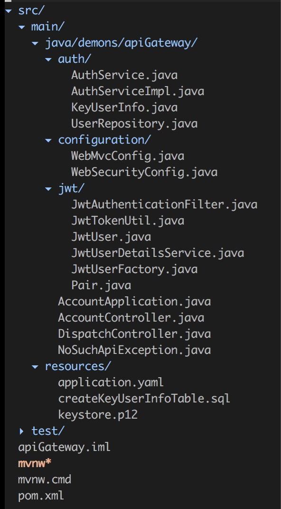
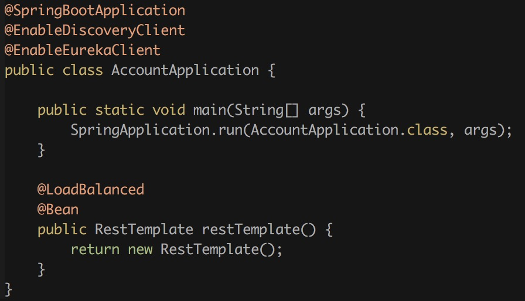
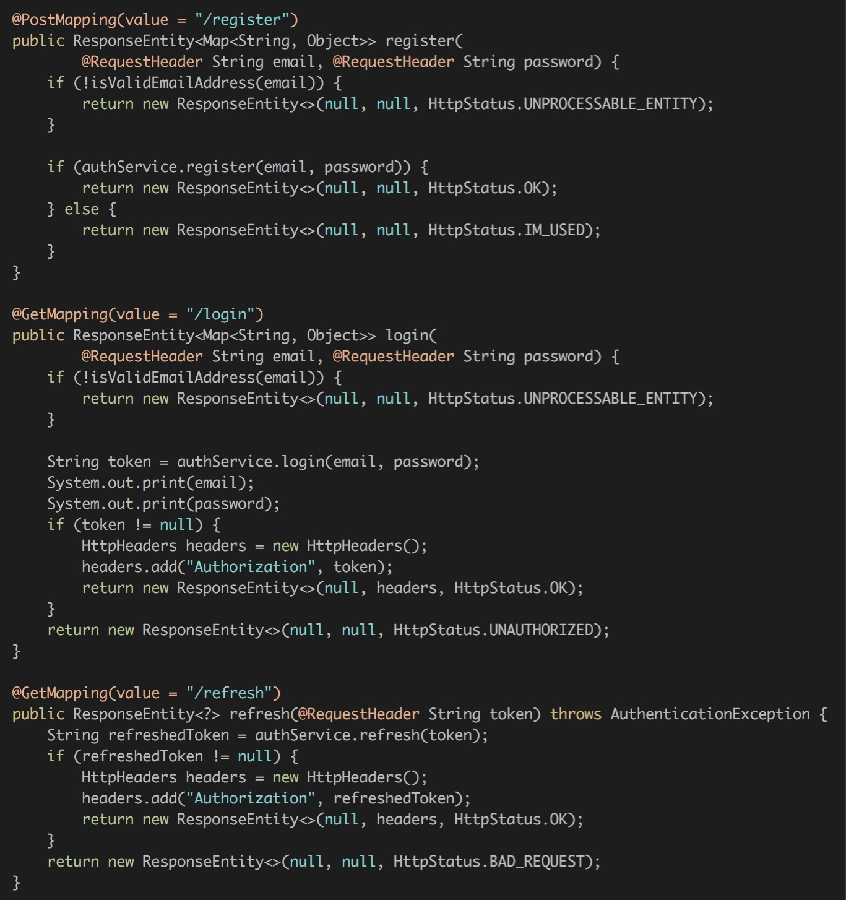
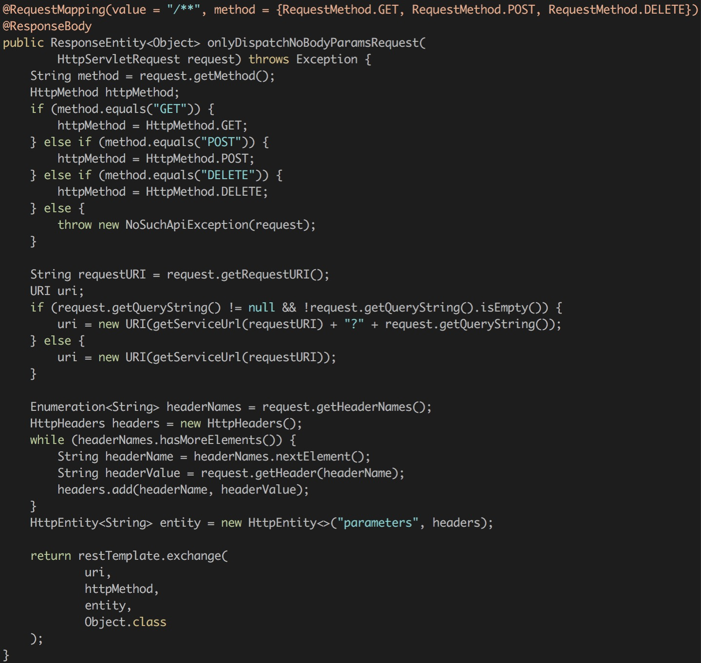
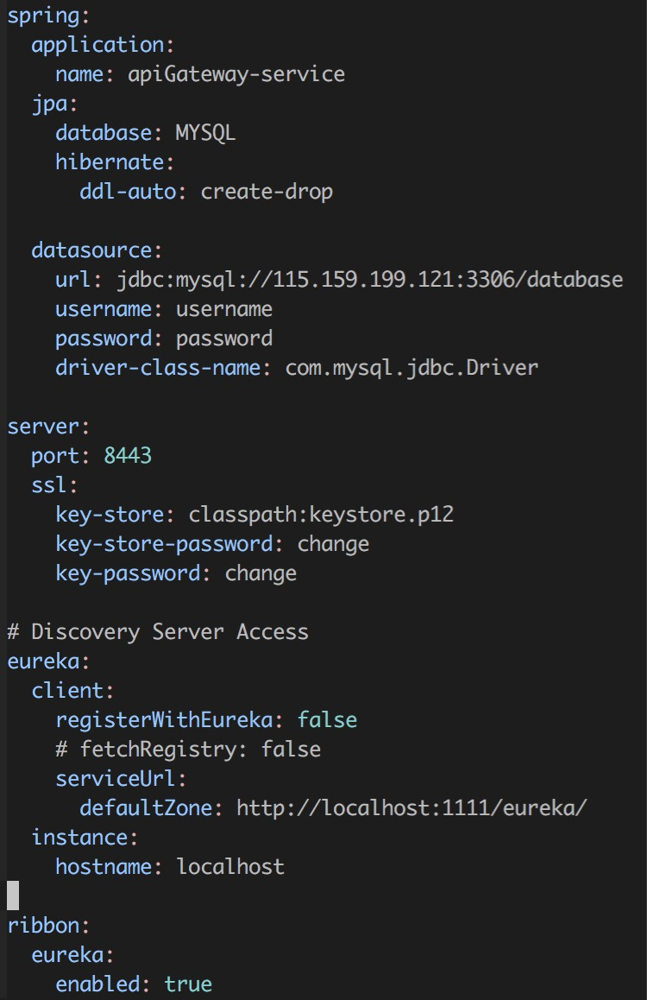
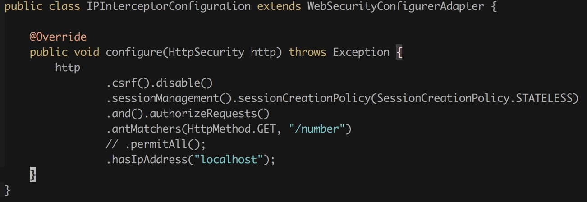

**MicorServiceDemo**是一个微服务的示意项目，在版本一的基础上添加API网关／用户注册登陆服务

添加API网关／用户注册有三种基本的思路：

+ 用户注册躲在网关后面，也即最直观的：所有的对服务的访问都必须经过网关

  这样做的问题是：

  + API网关对用户鉴权需要与用户注册登陆服务通信，而这个通信需要加密，实现起来比较麻烦
  + API网关验证用户身份不能再使用Spring Security自带的一些机制，实现上不美观

+ 用户注册登录服务挡在API网关之前

+ 用户注册登录服务和API网关融合成一个微服务

做法二和做法三没有太大的区别，考虑到实现上的简洁，采用做法三

没有采用Zuul自动转发的原因是：

+ 定制化难度大，如果在鉴权方面有特殊需求比较难满足

+ 没有充分利用Eureka+Ribbon负载均衡的功能

  我认为Eureka的主要功能是使得微服务互相发现，但其配合Ribbon确实也能够做负载均衡，我们不应该浪费这个能力

  换言之，虽然Eureka提供的是微服务内部的互相发现／API网关提供的是外界访问微服务的统一接口，但两者都有各自的负载均衡是一种浪费，应该让API网关借用Eureka的负载均衡能力

为了使得API网关有鉴权的功能，必须禁止用户直接访问微服务，这一点在诸多微服务的安全配置中都可见到

具体方法是，只允许Eureka和API网关所在的IP地址访问微服务，其他IP地址访问微服务均拒绝

工程结构

apiGateway是API网关和用户登录注册服务的结合体

communicationClass的诞生是因为：simpleClient和complicatedClient会用到一个相同的类（IntegerWrapper），其中simpleClient发送，complicatedClient接收；没有理由让两个工程都实现一遍这个类

nameServer是Eureka服务器

sidecar+nodejs用于演示非Java微服务如何集成进Spring微服务（这是version_1.md的主要内容之一，在此不再赘述）

complicatedClient／simpleClient是两个非常简单的微服务，提供简单的整数及加法

代码解读之apiGateway

auth/configuration/jwt都不是本文的重点，它们在配置Https以及为用户颁发授权码等

AccountApplication.java

如你所见，这段代码的作用是使得API网关能够借用Eureka去发现需要调用的微服务，以及做负载均衡

AccountController.java

对应着用户的注册／登录／授权码刷新

DispatchController.java

转发服务，这里比较头疼的是只能解析出带在header的参数，没办法解析出带在body的参数并转发

安全问题也值得考虑

application.yaml

比较特别的是把registerWithEureka设置为false，因为网关服务是不需要被其他微服务调用的

代码解读之simpleClient

整个工程十分简单，唯一值得注意的就是一份配置文件：

commit: `f15eaeee6d916657a6252731f45813e219d41ca1`

Update: 更新版本使用Zuul作为API网关，比手写的转发服务器更加简单易用；API文档位于https://documenter.getpostman.com/view/2041481/microservice/6fVWRGj

commit: `700a1e260f0ff0a48b20fcd7c62d2430674f8d66`
