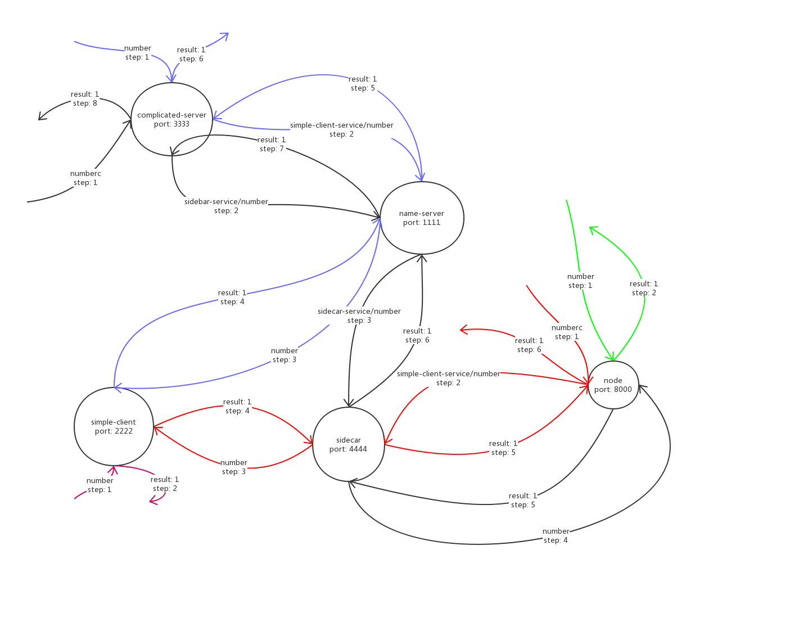
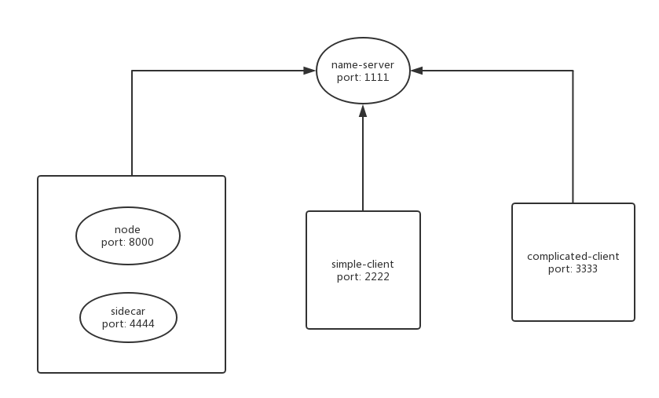
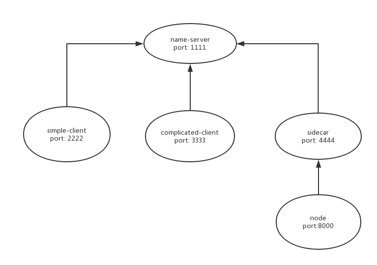
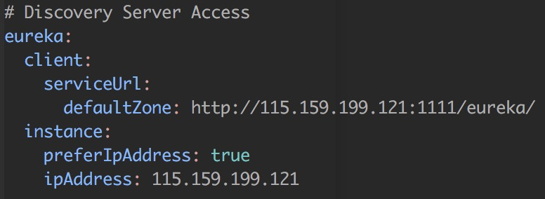
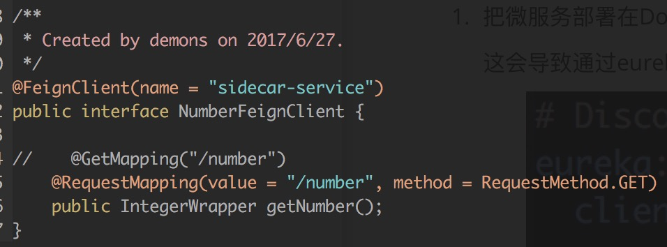

**MicorServiceDemo**是一个微服务的示意项目，该项目采用最简单的三个微服务，演示如何组合它们使之成为一个服务

下面三张图分别是：

1. 模拟五种客户端请求的处理过程，这张图展示了整一个架构中各个节点的作用

2. 逻辑视图，这张图意在强调sidecar实例与其他语言写的微服务实例之间的一一对应关系

3. 部署视图，这张图意在强调在使用Docker部署的情况下，sidecar与其他语言写的微服务应该部署在不同的容器内

   这样做的原因是：如果混合maven环境／node环境，则失去使用Docker的意义

   分开部署不仅方便（docker pull maven/node）而且保证了环境的单一

需要注意的坑：

1. 把微服务部署在Docker中，一定要手动设置eureka-client的ip地址，否则它会使用container ip而不是host ip

   这会导致通过eureka-server代理client的时候会导致真实地址不正确，具体来说，需要以下配置：

   

2. 其他语言写的微服务可以通过`sidecar服务器地址/要访问的微服务名称/API`的形式来直接访问Spring的微服务，但是Spring的微服务不可以通过`sidecar服务器地址/要访问的微服务名称/API`的形式来直接访问其他语言写的微服务

   需要通过`sidecar服务器地址/hosts/要访问的微服务名称`来获得真实地址，再用真实地址来调用API

   有一个名为`NumberFeignClient`的组件可以帮我们自动化中间步骤，我们需要做的就是写一个接口：

   

   主要在main函数所在类上标注`@EnableFeignClients`

   同时需要依赖于`spring-cloud-starter-feign`主键去自动为接口生成bean

3. 很多maven依赖的版本都是spring-cloud的版本决定的，所以不需要手动标注版本号，标注了反而可能出错

commit: `8ee12e2853feb3237ff224a620769c5dc9f444e8`
