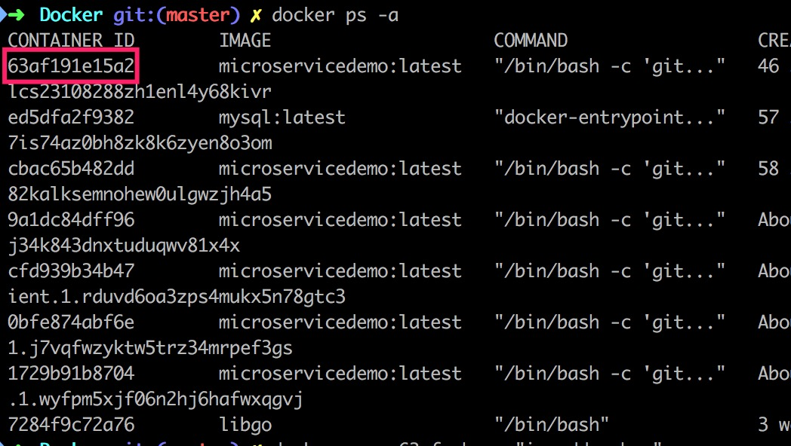

**MicroServiceDemo**是一个微服务示意项目，在版本二的基础上，把它与**Docker**结合起来

（毕竟，微服务和容器是好基友啊）

# 坑 #

## 一号坑 ##

如何找到名服务器？

之前的版本中，我们是手动指定名服务的真实IP地址的，这样做有两点不足：

+ 名服务可能被部署到不同的物理机器上（虽然可以通过配置指定名服务部署到“主”节点上）
+ 被迫开放名服务器的端口（我们不希望外界能够访问到名服务）

在这个版本中，我们直接使用**Docker**带来的服务端负载均衡技术，即如图：


很容易就解决了之前的问题

## 二号坑 ##

容器的网卡数量？


从以上两张图来看，我们的容器至少会有两张网卡，但实际上：




有三张网卡

那么，其它微服务会向名服务注册哪张网卡的地址呢？

（很可能是随机的，或者说是一个极其简单的规则；总之不是我们想要的）


通过`docker network inspect microservicedemo_backend_network`命令，我们可以知道：我们希望其它微服务向名服务注册的 IP 地址

那怎么做到这件事情（指定需要组册的网卡 / 地址）呢？


注意`docker-compose.yml`中的网络名称与`application.yaml`中的网络名称稍有不一致


真正的网络名称可以通过两种方式获得：

+ `docker stack deploy -c docker-compose.yml microservicedemo`命令的提示
+ 通过`docker network ls`查看并选取

## 三号坑 ##

如何减少编译需要的时间？


有一个“巨坑”是这样的：`Docker`在执行完每一条命令之后，会删除中间容器；我们下载的缓存也会被清除掉

原因是`maven`的本地仓库是一个“暂时”目录？

所以我们需要改动`settings.xml`文件：


把缓存目录设置为`/home/repository`，这样下载的缓存才不会被删除掉

## 四号坑 ##

诸如`simpleClient`的微服务总是找不到`communicationClass`依赖项？

（同三号坑）

# 说明 #

## API ##

我们设计的每一个 API 都有其用意，一定是为了验证什么东西

### simpleClient ###

#### NoApiGateway ####


四个方法分别验证：

+ `simpleCLient`微服务是否可访问
+ 通过 Path 传递参数
+ 通过 Headers 传递参数
+ 通过 Body 传递参数

#### ApiGateway ####


这一个版本验证：

+ `apiGateway`可以转发不同的请求
  + 普通请求
  + 参数放在 Path 的请求
  + 参数放在 Headers 的请求
  + 参数放在 Body 的请求
+ `apiGateway`可以验证用户身份

### complicatedClient ###

#### NoApiGateway ####


光看 API 很难知道这是为了什么，所以我们来看看源代码

##### one #####


检验能否调用其它 Java 微服务

##### two #####


检验能否调用非 Java 微服务（ Java -> Sidecar）

##### three #####


检验：通过客户端负载均衡调用自己的 API 接口

##### four #####


好像是配合`apiGateway`才能展示其作用？

看是否可以通过`apiGateway`获取用户信息？

#### ApiGateway ####


大部分同`simpleClient + apiGateway`，只说一下`four`这个接口


这说明`apiGateway`确实可以告诉我们：是哪个用户来访问 API ？

我们再看看不通过`apiGateway`访问`complicatedClient`与通过`apiGateway`访问`complicatedClient`的区别：


到这里我们确信：`apiGateway`可以告诉别的微服务当前用户是谁（当然`apiGateway`还可以提供其它信息）

### register & login & traceCallback ###


## 微服务之间互相访问 ##

## Java -> Node ##

## Node -> Java ##


## 如何证明已使用客户端负载均衡 ##


不妨调用`complcaitedClient`的`one` API ，然后看看容器日志：


可以看到使用容器的编号来做客户端负载均衡

而不是使用`simpleClient`这样的名字来隐式（悄悄地让`Docker`帮助我们）地做服务端负载均衡

# 运行 #

```shell
docker build -t micro-service-demo .
docker stack deploy -c docker-compose.yml microservicedemo
docker stack rm microservicedemo
```

构建镜像 + 部署微服务（运行容器）

