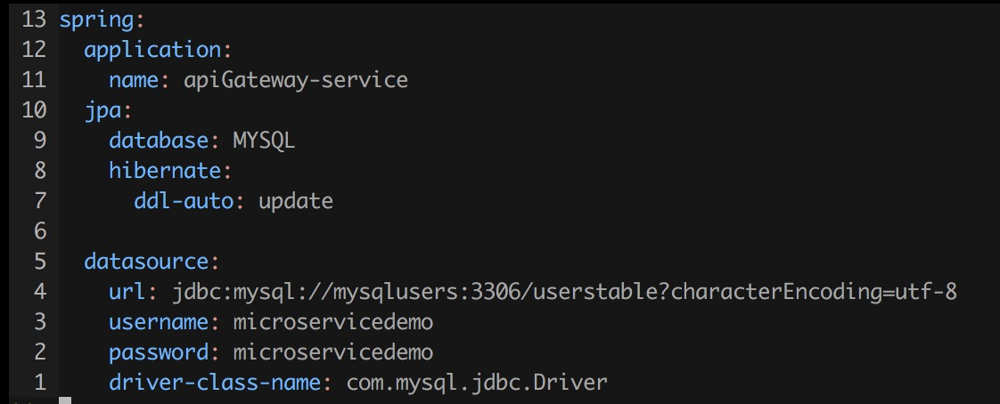

# 1. 微服务介绍 #

## 1.1 什么是微服务 ##

### 1.1.1 Martin Fowler ###

#### 1.1.1.1 a definition of this new architectural term ####

The term "Microservice Architecture" has sprung up over the last few years to describe a particular way of designing software applications as suites of independently deployable services. While there is no precise definition of this architectural style, there are certain common characteristics around organization around business capability, automated deployment, intelligence in the endpoints, and decentralized control of languages and data.

> “微服务架构”这个术语在过去几年里迅速变热，它描述了这样一种软件设计的方式：软件 = 一套可以独立部署的服务。对于这种架构形式，之前没有准确的定义，但（这些定义之间）都提到了一些共同点：围绕业务体量的组织 / 自动化部署 / 对语言和数据去中心化

"Microservices" - yet another new term on the crowded streets of software architecture. Although our natural inclination is to pass such things by with a contemptuous glance, this bit of terminology describes a style of software systems that we are finding more and more appealing. We've seen many projects use this style in the last few years, and results so far have been positive, so much so that for many of our colleagues this is becoming the default style for building enterprise applications. Sadly, however, there's not much information that outlines what the microservice style is and how to do it.

> 微服务这个词的突然兴起会让我们自然而然地鄙视它（和那些一味追寻它的人），但实际上越来越多的企业采用这种风格而成功，它应该成为构建商业应用的默认模式。然而，现在还没有足够的资料告诉我们：什么是微服务？怎么去实践微服务？

In short, the microservice architectural style is an approach to developing a single application as a suite of small services, each running in its own process and communicating with lightweight mechanisms, often an HTTP resource API. These services are built around business capabilities and independently deployable by fully automated deployment machinery. There is a bare minimum of centralized management of these services, which may be written in different programming languages and use different data storage technologies.

> 微服务 = 把软件拆分成一系列小的服务（每个服务运行于自己的进程中，服务之间通过一种轻量级的方式沟通；服务之间独立部署）
>
> 我认为此处轻量级的沟通方式主要指：这种沟通方式可以让微服务之间最大程度地解耦（不仅仅指在代码结构上，还指在编译 / 部署等阶段）
>
> 通常而言，这种轻量级的沟通方式是：HTTP resource API
>
> 存在一种部署机制，能够让微服务独立地 / 自动化地部署
>
> 在我的实践中，这种机制是由容器化技术提供的（传说中的 Docker 三剑客）
>
> 这些服务通过一种最小化的机制来管理（我认为只有软件最小化的时候，软件的可靠性才会提高；通俗些说，只有代码足够少，才值得信赖）

微服务 = 把软件拆分成一系列小的服务，服务具有以下特点：

+ 独立开发，可以采用不同的编程语言
+ 独立部署，自动化部署
+ 服务之间采用轻量级的沟通方式
+ 有一个最小化的且中心化的管理中心

To start explaining the microservice style it's useful to compare it to the monolithic style: a monolithic application built as a single unit. Enterprise Applications are often built in three main parts: a client-side user interface (consisting of HTML pages and javascript running in a browser on the user's machine) a database (consisting of many tables inserted into a common, and usually relational, database management system), and a server-side application. The server-side application will handle HTTP requests, execute domain logic, retrieve and update data from the database, and select and populate HTML views to be sent to the browser. This server-side application is a monolith - a single logical executable. Any changes to the system involve building and deploying a new version of the server-side application.

> 在正式解释微服务之前，我们把它与“巨服务”相比较：巨服务采用典型的三层架构（用户界面层 / 业务逻辑层 / 数据层），服务端的两层（尤其是业务逻辑层）包含了整个应用服务端的所有功能，可以看成是一个单一的逻辑实体 / 可执行实体。因此，对系统的任何改变都会导致整个系统的重新编译 / 部署


Such a monolithic server is a natural way to approach building such a system. All your logic for handling a request runs in a single process, allowing you to use the basic features of your language to divide up the application into classes, functions, and namespaces. With some care, you can run and test the application on a developer's laptop, and use a deployment pipeline to ensure that changes are properly tested and deployed into production. You can horizontally scale the monolith by running many instances behind a load-balancer.

> 巨服务是处理类似系统的一种非常自然的方式，所有的应用逻辑在运行时都是被同一个进程处理的，所以我们在开发时可以利用语言为我们提供的基本机制去拆解一个复杂的应用逻辑（比如创建不同的类 / 函数 / 命名空间）。在使用巨服务这种开发方式的时候，我们会使用一些测试去保证每一次修改都是正确的，因此形成一条流水线：开发 -> 测试 -> 发布 -> 部署（这条流水线大概就是持续集成或持续部署）。面对不断增长的请求，我们简单地修改架构：部署多个软件实体，在所有的软件实体之前添加负载均衡（服务端负载均衡或客户端负载均衡均可），就可以实现水平向扩展

Monolithic applications can be successful, but increasingly people are feeling frustrations with them - especially as more applications are being deployed to the cloud . Change cycles are tied together - a change made to a small part of the application, requires the entire monolith to be rebuilt and deployed. Over time it's often hard to keep a good modular structure, making it harder to keep changes that ought to only affect one module within that module. Scaling requires scaling of the entire application rather than parts of it that require greater resource.

> 采用巨服务开发的应用（在持续集成 / 持续部署 / 负载均衡的加持下）非常成功，但越来越多的人感到了它的不足，特别是在把它们搬到云上之后。小小的一个改变会导致整个应用的重新测试 / 编译 / 部署（所谓的改变曲线被捆绑在一起）；随着需求的改变，很难维持一开始良好的设计，模块与模块之间的耦合变得越来越严重，想改动一个模块往往会带来其它模块的变动；水平向扩展也越来越不顺手（由于巨服务不同部分的热点是不一样的）

针对模块耦合这一点，我个人的体会是：

+ 采用巨服务的形式开发，我们往往会采用接口进行模块之间的解耦；但我们可以注意到，采用接口进行解耦需要程序员具有良好的素质，我们没有办法限制自己在任何时候都规范操作，更不要说与其他人合作；在某个赶工的时候，我们自然放弃良好的习惯，长久以往，模块之间的耦合越来越严重
+ 采用微服务的形式开发，（如果把模块等同于每一个服务）服务之间的接口是强制性的，也就是程序员必须通过 HTTP 请求来获取其它模块提供的接口，程序员不可能直接获得接口的实体

两者最大的区别就在于“强制性”


These frustrations have led to the microservice architectural style: building applications as suites of services. As well as the fact that services are independently deployable and scalable, each service also provides a firm module boundary, even allowing for different services to be written in different programming languages. They can also be managed by different teams .

> 上述提到的痛点促使了微服务的出现：把应用拆解成一系列的服务

我认为微服务至少在以下几点有改进：

+ 独立部署使得对一个模块的改动不需要整个应用重新测试 / 编译 / 部署（也就是解耦改变曲线）
+ 每一个服务都提供一个非常**稳固**的模块边界（在这一点上与老爷子不谋而合）

但对于水平扩展上微服务是否更加有优势，我本人是怀疑的：如果是巨服务做水平向扩展，一个巨服务实例肯定也是服务于热点逻辑的代码运行得比较多，也就是：

+ 热点服务水平向扩展
+ 整个服务水平向扩展 + 热点服务对应的代码运行较多

上述两者是等价的

不过很快我又反驳了上面这个想法：因为所谓扩展必定涉及到监控（只有知道现有的计算能力不足以服务于所有请求，才知道需要水平向扩展；只有知道计算能力欠缺到什么程度，才知道需要扩展到什么程度），而监控哪一个服务的压力更大显然是容易的，不需要对逻辑代码有侵入性的（比如：查看哪一个容器占用资源较多），所以微服务在水平向扩展上更具备优势

所以我最后是这样理解的：

+ 监控服务（以容器的形式表现）是容易的
+ 监控容易，所以扩展容易

We do not claim that the microservice style is novel or innovative, its roots go back at least to the design principles of Unix. But we do think that not enough people consider a microservice architecture and that many software developments would be better off if they used it.

> 我们并没有宣称微服务是一个多么新颖的概念，它在很久以前就体现在 Unix 系统的设计上

微服务 vs 巨服务

微内核 vs 宏内核

#### 1.1.1.2 Characteristics of a Microservice Architecture ####

We cannot say there is a formal definition of the microservices architectural style, but we can attempt to describe what we see as common characteristics for architectures that fit the label.

> 我们不会给微服务下一个形式化的定义，但我们会尝试去描述它的一些特征（符合这些特征的就是微服务）

我们在数学上也常常见到这样的情况：不给一个概念直接下定义，而是采用一组公理描述它，凡是满足这组公理的都是这个概念（比如：矩阵）

As with any definition that outlines common characteristics, not all microservice architectures have all the characteristics, but we do expect that most microservice architectures exhibit most characteristics. While we authors have been active members of this rather loose community, our intention is to attempt a description of what we see in our own work and in similar efforts by teams we know of. In particular we are not laying down some definition to conform to.

> 当然这不可能和数学一样严谨，我们希望大多数微服务满足这些“公理”的绝大部分

软件开发不应该是这样的一个过程：我要用微服务 -> 所以需要使用什么样的技术 -> 反复检查是否满足一些条件

而应该是这样的一个过程：借鉴已有的架构 -> 为我们的应用定制 -> 调整之后不符合某些条件也就算了

##### Componentization via Services #####

For as long as we've been involved in the software industry, there's been a desire to build systems by plugging together components, much in the way we see things are made in the physical world. During the last couple of decades we've seen considerable progress with large compendiums of common libraries that are part of most language platforms.

> 软件工程一直有一个宏愿：软件系统组件化（为什么是宏愿呢？因为暂时还实现不了）

When talking about components we run into the difficult definition of what makes a component. Our definition is that a **component** is a unit of software that is independently replaceable and upgradeable.

> 什么是组件？可独立替换和升级的软件（软件太虚了，用代码替代之）

组件 = 一堆可以独立替换和升级的代码

Microservice architectures will use libraries, but their primary way of componentizing their own software is by breaking down into services. We define **libraries** as components that are linked into a program and called using in-memory function calls, while **services** are out-of-process components who communicate with a mechanism such as a web service request, or remote procedure call. (This is a different concept to that of a service object in many OO programs.)

> 微服务的开发必然会使用到库（正如面向对象的语言也会有命令式的语句）

库 = 通过链接进行组合，在内存原地调用的组件

服务 = 通过更加松的方式进行组合，通过 HTTP 请求或者 RPC 来调用的组件

所以可以简单粗暴地区分库和服务：一个“紧”，一个“松”

One main reason for using services as components (rather than libraries) is that services are independently deployable. If you have an application that consists of a multiple libraries in a single process, a change to any single component results in having to redeploy the entire application. But if that application is decomposed into multiple services, you can expect many single service changes to only require that service to be redeployed. That's not an absolute, some changes will change service interfaces resulting in some coordination, but the aim of a good microservice architecture is to minimize these through cohesive service boundaries and evolution mechanisms in the service contracts.

> 用服务代替库的最大的好处在于：独立部署（在改变曲线上解耦），当然采用微服务的架构并不意味着服务之间完全不影响（软件工程没有银弹），不过好的微服务会往“高内聚低耦合”发展，并且提供了一条可行的进化路线

所谓“松紧”，主要体现于两点：

+ 部署
+ 调用另一个组件的方式

正因为微服务更加“松”，它会让我们更改起来更不方便，给我们更大的力去让架构往高内聚低耦合的方向演进

（再说就涉及到玄学了：可以认为软件工程是关于人的科学，它关注与怎么让程序员放弃蝇头小利而关注于长远利益；它给程序员施加一个外力，让他们把软件往高内聚低耦合的方向演进）

Another consequence of using services as components is a more explicit component interface. Most languages do not have a good mechanism for defining an explicit Published Interface. Often it's only documentation and discipline that prevents clients breaking a component's encapsulation, leading to overly-tight coupling between components. Services make it easier to avoid this by using explicit remote call mechanisms.

> “强制性”

在什么地方开放自由度，在什么地方对程序员进行限制是理解很多架构乃至很多语言的关键：

+ Haskell 强制类型名大写而变量名小写
+ Haskell 限制串行代码（让你写串行代码很不爽）
+ Rust 限制不安全指针（让你用指针用起来蛋疼）

在微服务上：限制你获取类实体的能力，强制使用接口

（从这个角度上看，借鉴微服务的思想开发一门新语言是完全可行的，这门语言的主要能力是：规定实现 interface 的类都不可以被显式持有）

Using services like this does have downsides. Remote calls are more expensive than in-process calls, and thus remote APIs need to be coarser-grained, which is often more awkward to use. If you need to change the allocation of responsibilities between components, such movements of behavior are harder to do when you're crossing process boundaries.

> 代价：性能

At a first approximation, we can observe that services map to runtime processes, but that is only a first approximation. A service may consist of multiple processes that will always be developed and deployed together, such as an application process and a database that's only used by that service.

> 我们可以近似地认为：服务 = 进程
>
> 但也有可能几个关系非常紧密的进程构成一个服务

##### Organized around Business Capabilities #####

When looking to split a large application into parts, often management focuses on the technology layer, leading to UI teams, server-side logic teams, and database teams. When teams are separated along these lines, even simple changes can lead to a cross-team project taking time and budgetary approval. A smart team will optimise around this and plump for the lesser of two evils - just force the logic into whichever application they have access to. Logic everywhere in other words. This is an example of Conway's Law in action.

> 传统的开发团队都会分为三个部分：开发交互界面的专家，开发逻辑的专家，维护数据库的专家；哪怕一丁点的改动也需要跨团队的沟通和预算审批
>
> 有一个法则告诉我们：人事安排会反映在他们所开发的产品上，这种分层的人事安排也会导致相对固化的软件（谁也不愿意为他人而改变，甩锅大会开始）


The microservice approach to division is different, splitting up into services organized around **business capability**. Such services take a broad-stack implementation of software for that business area, including user-interface, persistant storage, and any external collaborations. Consequently the teams are cross-functional, including the full range of skills required for the development: user-experience, database, and project management.

> 采用微服务开发软件的团队会按照业务逻辑来拆分他们的团队，每一个小组负责一块业务逻辑，里面既有负责交互界面的程序员，也有负责后端逻辑的程序员，还有维护数据库的人员。

一个潜在的好处是：不同领域的知识在相互流动，更有可能培养出全栈工程师；倒不是一个人负责三个层次，而是每个人在做自己的任务时都对“别人需要什么”有了更好的理解


One company organised in this way is www.comparethemarket.com. Cross functional teams are responsible for building and operating each product and each product is split out into a number of individual services communicating via a message bus.

> 服务之间的沟通依赖于 message bus

message bus 或许是一个值得关注的点

Large monolithic applications can always be modularized around business capabilities too, although that's not the common case. Certainly we would urge a large team building a monolithic application to divide itself along business lines. The main issue we have seen here, is that they tend to be organised around too many contexts. If the monolith spans many of these modular boundaries it can be difficult for individual members of a team to fit them into their short-term memory. Additionally we see that the modular lines require a great deal of discipline to enforce. The necessarily more explicit separation required by service components makes it easier to keep the team boundaries clear.

> 当然，并不是说采用巨服务的团队就不会按照业务逻辑来划分模块，而是说巨服务没有非常明确地划分不同团队的职责（每一个团队负责的模块都有如此多的上下文，医考短期记忆很难去记住模块之间的边界）

很有意思的一个点：微服务清晰地界定了团队职责

##### Products not Projects #####

Most application development efforts that we see use a project model: where the aim is to deliver some piece of software which is then considered to be completed. On completion the software is handed over to a maintenance organization and the project team that built it is disbanded.

Microservice proponents tend to avoid this model, preferring instead the notion that a team should own a product over its full lifetime. A common inspiration for this is Amazon's notion of "you build, you run it" where a development team takes full responsibility for the software in production. This brings developers into day-to-day contact with how their software behaves in production and increases contact with their users, as they have to take on at least some of the support burden.

The product mentality, ties in with the linkage to business capabilities. Rather than looking at the software as a set of functionality to be completed, there is an on-going relationship where the question is how can software assist its users to enhance the business capability.

There's no reason why this same approach can't be taken with monolithic applications, but the smaller granularity of services can make it easier to create the personal relationships between service developers and their users.

总体来说，上面四段话的意思是：

+ 项目是做完 / 交付之后就可以走的
+ 产品是开发团队在其生命周期中一直需要维护的
+ 微服务更加利于产品

##### Smart endpoints and dumb pipes #####

"聪明"的终端 & “笨笨”的管道

这两个词让我想到五层网络协议栈的开发：当时有两派开发协议栈的团队，一派认为我们的链路（也就是网络的中心，或者说管道本身）需要足够“聪明”，足够“可靠”，而我们的终端可以“傻”一点；另一派则相反，他们认为链路需要足够简单（只传数据，至于速度是多少 / 传到了没有都不需要管）；今天看来后者获胜

When building communication structures between different processes, we've seen many products and approaches that stress putting significant smarts into the communication mechanism itself. A good example of this is the Enterprise Service Bus (ESB), where ESB products often include sophisticated facilities for message routing, choreography, transformation, and applying business rules.

> 在开发不同进程的沟通结构时，我们看到很多产品都认为：要让沟通机制“聪明”一些，要把我们的智慧施加到沟通机制本身上去

The microservice community favours an alternative approach: *smart endpoints and dumb pipes*. Applications built from microservices aim to be as decoupled and as cohesive as possible - they own their own domain logic and act more as filters in the classical Unix sense - receiving a request, applying logic as appropriate and producing a response. These are choreographed using simple RESTish protocols rather than complex protocols such as WS-Choreography or BPEL or orchestration by a central tool.

> 但是微服务的开发团队不是这么认为的，相反地：终端（也就死每一个服务）需要足够“聪明”而沟通机制本身要很简单，因为这样体现了：高内聚低耦合
>
> 每一个服务都表现得像一个过滤器（filters）：接受一个请求 -> 应用一些逻辑 -> 提供适当的相应

The two protocols used most commonly are HTTP request-response with resource API's and lightweight messaging. The best expression of the first is


Microservice teams use the principles and protocols that the world wide web (and to a large extent, Unix) is built on. Often used resources can be cached with very little effort on the part of developers or operations folk.

> 有两种常用的沟通协议：HTTP 请求 & 简单的消息巴士
>
> 使用 HTTP 请求时，我们常常请求那些缓存起来比较不费劲的资源

对于使用 HTTP 请求作为沟通方式的服务，有一个很简单的原则：使用现有的协议而不要使用基于现有协议开发出来的新协议（我不确定这句话理解对了）

我认为，从这个角度看，REST 的价值体现在：

+ 强迫沟通方式变得更加“傻”
+ 从而强迫终端变得更加“聪明”

所以，REST 通过限制沟通能力的方式来提升模块的内聚程度并降低模块之间的耦合程度

The second approach in common use is messaging over a lightweight message bus. The infrastructure chosen is typically dumb (dumb as in acts as a message router only) - simple implementations such as RabbitMQ or ZeroMQ don't do much more than provide a reliable asynchronous fabric - the smarts still live in the end points that are producing and consuming messages; in the services.

> 第二种沟通方式是：选择一个足够轻量级的消息巴士（轻量级的意思是消息巴士只传递消息，不做额外的事情）

In a monolith, the components are executing in-process and communication between them is via either method invocation or function call. The biggest issue in changing a monolith into microservices lies in changing the communication pattern. A naive conversion from in-memory method calls to RPC leads to chatty communications which don't perform well. Instead you need to replace the fine-grained communication with a coarser -grained approach.

> 把巨服务改成微服务最大的挑战在于：改变沟通模式
>
> 并不是把沟通的外在表现形式从 in-memory 改成 RPC 就叫微服务，而是要把沟通方式改成更加粗粒度的方式

我认为从这个角度看，巨服务的不足在于：沟通的能力太过强大，也就是管道太过“聪明”

（我们不仅仅可以有各种各样的参数与返回值，还可以认为设定函数调用的环境）

更糟糕的是，我们往往意识不到：我们用于沟通各模块的管道太过“聪明”

##### Decentralized Governance #####

One of the consequences of centralised governance is the tendency to standardise on single technology platforms. Experience shows that this approach is constricting - not every problem is a nail and not every solution a hammer. We prefer using the right tool for the job and while monolithic applications can take advantage of different languages to a certain extent, it isn't that common.

> 集中化管理的后果之一是：在单一技术平台下被“标准化”
>
> 经验告诉我们这样时不行滴，因为不是每一个问题都是钉子而每一个解决方案都是锤子；我们更希望用适当的工具去完成特定的工作

我认为：不要期待任何一个语言或则任何一种技术可以解决全部问题

经常有人在讨论语言的好坏，套路经常是这个语言解决不好这个这个问题，解决不好那个那个问题；借用机器学习的 NFL 定理：一个能解决所有问题的方案在解决任何问题上效果都一样差

更直白一些说：微服务允许我们对不同的业务逻辑选取不同的工具

Splitting the monolith's components out into services we have a choice when building each of them. You want to use Node.js to standup a simple reports page? Go for it. C++ for a particularly gnarly near-real-time component? Fine. You want to swap in a different flavour of database that better suits the read behaviour of one component? We have the technology to rebuild him.

> 针对不同业务逻辑的需求，选取不同的技术

Of course, just because you *can* do something, doesn't mean you *should* - but partitioning your system in this way means you have the option.

> 当然，微服务给我们选择的权利，并不意味着我们要把所有可能的技术方案都用进来（这非常愚蠢）

Teams building microservices prefer a different approach to standards too. Rather than use a set of defined standards written down somewhere on paper they prefer the idea of producing useful tools that other developers can use to solve similar problems to the ones they are facing. These tools are usually harvested from implementations and shared with a wider group, sometimes, but not exclusively using an internal open source model. Now that git and github have become the de facto version control system of choice, open source practices are becoming more and more common in-house.

> 选取技术方案的一个很重要的标准是：有没有人用相同的技术方案解决过类似的问题？

额外说一句：有人用类似的技术方案解决过类似的问题往往意味着有人踩过坑，也意味着即使掉到坑里，别人也有能力把你捞出来（这一点相当重要，有的时候甚至比技术本身的优势更加重要）

Netflix is a good example of an organisation that follows this philosophy. Sharing useful and, above all, battle-tested code as libraries encourages other developers to solve similar problems in similar ways yet leaves the door open to picking a different approach if required. Shared libraries tend to be focused on common problems of data storage, inter-process communication and as we discuss further below, infrastructure automation.

For the microservice community, overheads are particularly unattractive. That isn't to say that the community doesn't value service contracts. Quite the opposite, since there tend to be many more of them. It's just that they are looking at different ways of managing those contracts. Patterns like Tolerant Reader and Consumer-Driven Contracts are often applied to microservices. These aid service contracts in evolving independently. Executing consumer driven contracts as part of your build increases confidence and provides fast feedback on whether your services are functioning. Indeed we know of a team in Australia who drive the build of new services with consumer driven contracts. They use simple tools that allow them to define the contract for a service. This becomes part of the automated build before code for the new service is even written. The service is then built out only to the point where it satisfies the contract - an elegant approach to avoid the 'YAGNI' dilemma when building new software. These techniques and the tooling growing up around them, limit the need for central contract management by decreasing the temporal coupling between services.

Perhaps the apogee of decentralised governance is the build it / run it ethos popularised by Amazon. Teams are responsible for all aspects of the software they build including operating the software 24/7. Devolution of this level of responsibility is definitely not the norm but we do see more and more companies pushing responsibility to the development teams. Netflix is another organisation that has adopted this ethos. Being woken up at 3am every night by your pager is certainly a powerful incentive to focus on quality when writing your code. These ideas are about as far away from the traditional centralized governance model as it is possible to be.

##### Microservices and SOA #####

##### Decentralized Data Management #####

Decentralization of data management presents in a number of different ways. At the most abstract level, it means that the conceptual model of the world will differ between systems. This is a common issue when integrating across a large enterprise, the sales view of a customer will differ from the support view. Some things that are called customers in the sales view may not appear at all in the support view. Those that do may have different attributes and (worse) common attributes with subtly different semantics.

> 数据管理的去中心化会在不同层次有不同不同的表现形式
>
> 在最抽象的层次上，不同系统对真实世界的概念性抽象会不一样，这在大公司的系统整合上是一个常见问题：比如说销售人员眼中的顾客和支持人员眼中的顾客不是一回事，反映在软件系统中，可能是两个顾客类具有不同的属性，或者更加糟糕：两个顾客类具有相同的属性而属性的含义不尽相同

不妨简单地理解为：数据管理的去中心化会体现在总体设计 / 详细设计 / 代码实现上

This issue is common between applications, but can also occur within applications, particular when that application is divided into separate components. A useful way of thinking about this is the Domain-Driven Design notion of Bounded Context. DDD divides a complex domain up into multiple bounded contexts and maps out the relationships between them. This process is useful for both monolithic and microservice architectures, but there is a natural correlation between service and context boundaries that helps clarify, and as we describe in the section on business capabilities, reinforce the separations.

> 数据管理的去中心化会在不同应用中有所展现，也会在一个应用中体现（特别是这个应用被划分成不同的组件），一种常用的手段是 DDD
>
> 一个复杂的领域 = 限定边界的环境 + 它们之间的关系
>
> DDD 对于巨服务和微服务都有不错的效果，不过正如我们之前所说的那样，因为微服务天然具有更加清晰的边界，所以它与 DDD 的对应性也更加好

仍然在强调边界的清晰性

As well as decentralizing decisions about conceptual models, microservices also decentralize data storage decisions. While monolithic applications prefer a single logical database for persistant data, enterprises often prefer a single database across a range of applications - many of these decisions driven through vendor's commercial models around licensing. Microservices prefer letting each service manage its own database, either different instances of the same database technology, or entirely different database systems - an approach called Polyglot Persistence. You can use polyglot persistence in a monolith, but it appears more frequently with microservices.

> 在实现层面上，微服务也会做数据管理的去中心化
>
> 巨服务的应用会更加倾向于使用一个单一的本地数据库去吃持久化数据，甚至是多个应用共同使用一个数据库（具体使用哪个数据库很大程度上是根据上游厂商的价格策略决定的）
>
> 而微服务更加倾向于让不同的服务使用同一个数据库的不同实体或者干脆事不同数据库的实体

Polyglot Persistence 值得关注


我们可以看到：

+ 不同服务的实体使用不同的数据库实体（绿色 & 灰色）
+ 同一个服务的不同实体使用相同饿数据库实体（红色）

Decentralizing responsibility for data across microservices has implications for managing updates. The common approach to dealing with updates has been to use transactions to guarantee consistency when updating multiple resources. This approach is often used within monoliths.

> 数据管理的去中心化一定会给数据的增删改带来挑战，在巨服务中我们通常使用事务来保证一致性

巨服务的不同模块往往使用同一个数据库，所以数据增删改的事务性往往可以由数据库来保证

但一旦我们使用微服务，把数据库拆分掉，那么自然不能只依靠数据库来实现事务性

Using transactions like this helps with consistency, but imposes significant temporal coupling, which is problematic across multiple services. Distributed transactions are notoriously difficult to implement and as a consequence microservice architectures emphasize transactionless coordination between services, with explicit recognition that consistency may only be eventual consistency and problems are dealt with by compensating operations.

> 在不同服务之间引入事务性会导致它们的耦合（这个耦合可能不仅仅是 Martin Fowler 所说的 temproral coupling，如果设计得不好，很可能会导致代码层面的强耦合）
>
> 同时，分布式系统实现事务性是一个非常难搞的话题
>
> 所以：如果采用微服务架构，尽量在服务之间做到 transactionless（如何合理拆分服务？）
>
> 即使服务之间由一致性问题，我们也认为只能实现最终一致性，其它的问题交给逻辑代码去处理

这一段话提到了微服务面临的巨大困难：如何在不同服务之间引入事务性从而解决一致性问题？

我认为 Martin Fowler 提出了两种解决方案：

+ 尽量合理拆分服务，使得服务之间不出现或者少出现这种一致性问题
+ 即使出现了，我们也只实现最终一致性

其实不仅仅是微服务面临分布式系统的一致性问题，所有希望得到水平向扩展的架构都面临这个问题：

如果我们尝试通过增加数据库实例来解决数据库性能瓶颈，那么一致性问题怎么办？

所以：数据库最难水平向扩展

Choosing to manage inconsistencies in this way is a new challenge for many development teams, but it is one that often matches business practice. Often businesses handle a degree of inconsistency in order to respond quickly to demand, while having some kind of reversal process to deal with mistakes. The trade-off is worth it as long as the cost of fixing mistakes is less than the cost of lost business under greater consistency.

> 放弃强一致性对于许多开发团队来说似乎是一个挑战，不过这也是符合商业实践的
>
> 只要弥补不一致的代价低于维护强一致性的代价就可以

##### Infrastructure Automation #####

Infrastructure automation techniques have evolved enormously over the last few years - the evolution of the cloud and AWS in particular has reduced the operational complexity of building, deploying and operating microservices.

> 基础设施自动化技术（Infrastructure automation techniques）在过去几年进化得很快

Many of the products or systems being build with microservices are being built by teams with extensive experience of Continuous Delivery and it's precursor, Continuous Integration. Teams building software this way make extensive use of infrastructure automation techniques. This is illustrated in the build pipeline shown below.

> 持续集成 & 持续部署也在帮助基于微服务的应用开发


Since this isn't an article on Continuous Delivery we will call attention to just a couple of key features here. We want as much confidence as possible that our software is working, so we run lots of **automated tests**. Promotion of working software 'up' the pipeline means we **automate deployment** to each new environment.

我们在这一小节会省略一些段落，省略的段落大意是：如果投资过一次持续部署，再次使用它并没有很昂贵的成本；同样地，把适用于巨服务开发的持续部署拿过来给微服务开发使用也没有什么不同


##### Design for failure #####

A consequence of using services as components, is that applications need to be designed so that they can tolerate the failure of services. Any service call could fail due to unavailability of the supplier, the client has to respond to this as gracefully as possible. This is a disadvantage compared to a monolithic design as it introduces additional complexity to handle it.

> 使用服务作为组件相比于巨服务会有一个劣势：每一次服务调用都有失败的可能，客户端（这个客户端不是指在用户设备上的客户端，而是指发起服务调用的服务）需要优雅地应对这些失败
>
> 巨服务的模块调用是存在于内存的（in-memory），失败的可能性是非常低的，以至于可以忽略不计
>
> 那么微服务的开发者不得不面对这样的复杂性

The consequence is that microservice teams constantly reflect on how service failures affect the user experience. Netflix's Simian Army induces failures of services and even datacenters during the working day to test both the application's resilience and monitoring.

> 微服务的开发团队自然非常关心：我们有没有合理地应对服务的失效？服务的失效对用户有什么样的影响？
>
> 比如说：Netflix 专门有一个团队在生产环境中故意导致某些服务甚至数据中心的失效，看看应用的弹性和对应用的监控能力

This kind of automated testing in production would be enough to give most operation groups the kind of shivers usually preceding a week off work. This isn't to say that monolithic architectural styles aren't capable of sophisticated monitoring setups - it's just less common in our experience.

> 在生产环境中做这样的事情，会给开发团队带去非常大的压力；也促使他们正确地应对服务失效
>
> 当然，在基于巨服务的开发中也可以使用这样的策略，不过很少看到具体的实践（没必要吧）

Since services can fail at any time, it's important to be able to detect the failures quickly and, if possible, automatically restore service. Microservice applications put a lot of emphasis on real-time monitoring of the application, checking both architectural elements (how many requests per second is the database getting) and business relevant metrics (such as how many orders per minute are received). Semantic monitoring can provide an early warning system of something going wrong that triggers development teams to follow up and investigate.

> 因为服务很可能随时会挂掉，那么快速地检测与自动恢复就显得尤为重要；基于微服务开发的应用花费了很多精力去实时测量有关于架构的数据和有关于业务的数据，这些数据可以提前发出预警，让开户团队尽早修复

This is particularly important to a microservices architecture because the microservice preference towards choreography and event collaboration leads to emergent behavior. While many pundits praise the value of serendipitous emergence, the truth is that emergent behavior can sometimes be a bad thing. Monitoring is vital to spot bad emergent behavior quickly so it can be fixed.

> 监控是很重要滴

Monoliths can be built to be as transparent as a microservice - in fact, they should be. The difference is that you absolutely need to know when services running in different processes are disconnected. With libraries within the same process this kind of transparency is less likely to be useful.

通过库的方式提供的组件比较少出现不能连接的情况，我们一般不予考虑

Microservice teams would expect to see sophisticated monitoring and logging setups for each individual service such as dashboards showing up/down status and a variety of operational and business relevant metrics. Details on circuit breaker status, current throughput and latency are other examples we often encounter in the wild.

##### Evolutionary Design #####

Whenever you try to break a software system into components, you're faced with the decision of how to divide up the pieces - what are the principles on which we decide to slice up our application? The key property of a component is the notion of independent replacement and upgradeability - which implies we look for points where we can imagine rewriting a component without affecting its collaborators. Indeed many microservice groups take this further by explicitly expecting many services to be scrapped rather than evolved in the longer term.

如何拆分应用？

服务是组件的一种形式，因此要满足两个特性：

+ 可替换
+ 可升级

### 1.1.2 Myself ###

我认为微服务具备三个非常重要的特征：

+ 更加清晰的组件边界
+ 强制性的接口
+ “傻”一点的沟通方式，“聪明”一点的终端

微服务在这些地方带来变革：

+ 改变某部分使之重新上线的成本更低
+ 独立的数据库
+ 更加容易进行监控也更有必要进行监控

## 1.2 Spring 简介 & Spring 与 Tomcat 的关系 ##


这张图的左半边说明了 Servlet 与 Spring 的关系

## 1.3 Spring 对微服务的支持 ##

# 2. 运行示例 #

```shell
git clone https://github.com/Clcanny/MicroServiceDemo.git
cd MicroServiceDemo/Docker
docker build -t microservicedemo .
docker stack deploy -c docker-compose.yml microservicedemo
// 查看各个服务的状态
docker stack services microservicedemo
// 删除微服务
docker stack rm microservicedemo
```

等待所有的服务启动成功，然后打开 postman


选择`test.microservicedemo.postman_collection.json`，导入 collection


选择`microservicedemo.environment.postman_environment.json`，导入 environment

注意 Bear Token 是会过期的，一旦过期，通过 login API 重新获取一个，然后填写到 environment 里

由于我们的数据库文件没有挂载到宿主机的文件系统下，所以每次重启服务都需要重新注册：


然后就可以测试我们的部署是否成功：


注意选择环境，否则不能通过 API 网关

如果运行成功，说明示例没有问题

# 3. 简化依赖项 #

在没有简化依赖项之前，所有的项目的依赖项都很混乱，同时存在大量重复，至少有两个问题：

+ 不便于管理（看看200多行的依赖项，还全是各种各样的版本，会不会有兼容性问题？）
+ 不便于升级依赖项（全靠手工一个一个改）

## 3.1 父依赖文件 ##

这主要是解决重复问题，我们发现以下几个项目的依赖项存在大量重复：

+ simpleClient
+ complicatedClient
+ sidecar
+ nameServer
+ traceCallback
+ apiGateway

所以我们在它们共同的父文件夹下创建了`pom.xml`，把相同的依赖项集中起来

后来我们又发现，communicationClass 也与之前的项目的依赖项存在太多的重复

但 communicationClass 不能直接使用父文件夹下的 pom.xml，因为父文件夹下的 pom.xml 的其中一个依赖项就是 communicationClass，会导致环形引用

于是我们采取了这样的一套方案：

+ grandparent.pom.xml <- parent.pom.xml <- pom.xml of simpleClient
+ grandparent.pom.xml <- parent.pom.xml <- pom.xml of complicatedClient
+ ……
+ grandparent.pom.xml <- pom.xml of communicationClass

化简之后的结果（simpleClient）：


注意：我们没有重复`groupId`与`version`，而是采用了 grandparent.pom.xml 中的配置


最后一点：grandparent.pom.xml 与 parent.pom.xml 放在同一个文件夹下

这里稍微有坑的是：grandparent.pom.xml 需要安装到本地 maven 仓库，否则会对后续项目的构建带来影响（具体做法可以参考 Dockerfile 文件）

## 3.2 启动器 ##

总的来说，启动器代表着一系列相关的依赖项

一个启动器约等于一系列相关的 / 完成某个任务都需要用到的依赖项

具体参考 Documents/Dependencies/SpringBootStarter/SpringBootStarter.md

## 3.3 依赖项版本管理 ##

我们常见的依赖项是这样写的：

```xml
<!-- https://mvnrepository.com/artifact/org.springframework.boot/spring-boot-starter-web -->
<dependency>
    <groupId>org.springframework.boot</groupId>
    <artifactId>spring-boot-starter-web</artifactId>
    <version>1.5.9.RELEASE</version>
</dependency>
```

如果每一个依赖项都有一个版本，首先是看着就很繁琐，其次是还有兼容性问题

我们出一个大招解决它（在 grandparent.pom.xml 文件中）：


几乎所有的启动器依赖项都不需要写版本号（在我们的项目中，所有的启动器依赖项都不需要写版本号）

那我们还有一个疑惑，其它项目的 parent 是 grandparent.pom.xml 或者是 parent.pom.xml，对应的版本号是 `0.0.1-SNAPSHOT`（不妨以 simpleClient 为例）：


那么，simpleClient 的启动器的版本是`0.0.1-SNAPSHOT`还是`1.5.4.RELEASE`？

通过`mvn help:effective-pom`命令来查看真实生效的 pom.xml：


很显然：是`1.5.4.RELEASE`

# 4. 与容器技术配合 #

诸多服务的一键部署离不开容器技术

## 4.1 Dockerfile ##

### Part 1 ###


`/home/repository`是 maven 本地仓库的地址（修改 maven 的默认仓库地址主要是防止缓存在镜像构建过程中被删除）

settings.xml 有两个作用：

+ 使用阿里提供的仓库，加快依赖项的下载速度
+ 修改 maven 默认仓库的位置


### Part 2 ###


替换源（使用163提供的源）的目的是使得软件下载更快

dnsutils 主要提供 nslookup 之类的工具（nslookup 会帮助我们判断在名服务器上登记的地址是否正确）

### Part 3 ###


`mvn dependency:go-ofline`命令与`mvn dependency:resolve-plugins`命令都是缓存依赖项的命令，它们能够提升我们启动服务的实践（不需要花大量的实践去阿里的仓库下载依赖项）

`mvn install`命令是把 grandparent.pom.xml 安装到本地仓库


parent.pom.xml 同理

### Part 4 ###


把 communicationClass 安装到本地仓库

因为我们在这里跌过跟头，所以我们专门添加了两条测试命令去看安装是否成功（或者说缓存是否随着中间容器的移除而消失）

### Part 5 ###


安装 node 并且安装相关依赖包，支持 number.js 的运行

## 4.2 docker-compose.yml ##


大多数都不言自明，只有几个地方需要注意：

+ `networks`用于指定服务参与的网络（决定容器内的网卡数量？）
+ `start_period`用于指定服务启动的时间，在这段时间内没有通过测试命令也不会关掉容器（并开启一个新容器）
+ `depends_on`用于指定哪些服务需要先于本服务启动
+ `endpoint_mode`用于指定容器的 IP 地址是如何分配的（好像不太准确？），因为要使用客户端负载均衡，我们选择`vip`，即虚拟 IP（virtual ip）；另外一种模式是用于服务端负载均衡的（好像是 Docker 帮我们做负载均衡）？


我们需要创建一个网路用于容器间通信（不使用默认网络是因为我想自己命名网络）

在后面我们会看到网络名字非常重要，它能够告诉每一个服务：向名服务注册哪张网卡的 IP 地址

通过`docker network ls`命令和`docker network inspect microservicedemo_backend_network`命令可以查看网络状态

## 4.3 application.yaml ##

### 4.3.1 simpleClient ###

```shell
vim simpleClient/src/main/resources/application.yaml
```


`spring-application-name`决定当前服务的名字（在向名服务注册的时候会用到这个名字，名字可以作为服务的唯一标识符），其它服务会通过`http://SIMPLE-CLIENT-SERVICE/...`来访问相应的接口

`spring-cloud-inetutils-preferredNetworks`决定当前服务的可访问 IP 地址，我们知道一个容器会有不止一张虚拟网卡，导致一个容器具有不止一个 IP 地址；因此，我们必须告诉 simpleClient 服务：向名服务注册哪一个 IP 地址


`eureka-client-serviceUrl-defaultZone`告诉 simpleClient 服务：名服务的地址

其中我们使用 nameserver 作为网址名，隐式地使用了 Docker 提供的服务端负载均衡

`eureka-instance-preferIpAddress`与`eureka-instance-preferIpAddress`配合起来是解决“向名服务器注册的 IP 地址其它服务不可访问”的问题的，不过有人指出这样做事实上使用了 Docker 提供的服务端负载均衡而不是我们所希望的客户端负载均衡

我猜测这两个选项的作用是：

+ 不使用 IP 地址向名服务注册
+ 而使用 hostname 向名服务注册

所以，当其它服务的实例想要访问 simpleClient 的时候，从名服务拿到的地址是 simpleClient 而不是 list of ips；访问 simpleClient 实际上还是使用由 Docker 提供的服务端负载均衡

所以我们不采用这两个选项（在写完这段文字之后，我删掉了这两个选项）


`server-port`是在配置 Tomcat 监听的端口


`ribbon-eurela-enabled`用于开启客户端负载均衡

### 4.3.2 apiGateway ###

```shell
vim apiGateway/src/main/resources/application.yaml
```


`eureka-client-registerWithEureka`配置 apiGateway 不要向名服务注册自己，因为没有其它服务需要使用 apiGateway 提供的服务 / 接口；因此，也不需要使用`spring-cloud-inetutils-preferredNetworks`选项



主要关注一下数据库相关的配置


主要关注一下 SSL / HTTPS 相关的配置，这部分还需要：

+ 代码
+ 额外的文件

支持（我们在后面会讲怎么配置）

### 4.3.3 nameServer ###

```shell
vim nameServer/src/main/resources/application.yaml
```


# 5. 微服务互相访问 #

## 5.1 名服务器 & 服务端负载均衡 ##

## 5.2 Java -> Java ##

## 5.3 Java -> Node ##

## 5.4 Node -> Java ##

# 6. communictionClass #

## 6.1 非侵入式截取请求 & traceCallback ##

## 6.2 微服务交换数据 ##

# 7. 鉴权与安全 #

## 7.1 转发技术 ##

## 7.2 JWT ##

## 7.3 数据库 ##

## 7.4 网关 ##

## 7.5 Spring Security ##

# 8. 扩展阅读 #

## 8.1 如何做到自动伸缩 ##

## 8.2 哪一部分不可水平向扩展 ##

## 8.3 性能监控 ZipKin ##

## 8.4 分布式日志收集 Kafka ##

## 8.5 网关与 Sidecar 不愉快的碰面 ##

## 8.6 Docker 为我们提供的服务可靠吗 ##

# 9. 参考资料 #

[Spring Framework Reference Documentation](https://docs.spring.io/spring/docs/5.0.0.BUILD-SNAPSHOT/spring-framework-reference/htmlsingle/)

[version_0.1](Documents/version_0.1/version_0.1.md)

[version_0.2](Documents/version_0.2/version_0.2.md)

[version_0.3](Documents/version_0.3/version_0.3.md)

[Microservices](https://martinfowler.com/articles/microservices.html)

[SpringBootStarter](Documents/Dependencies/SpringBootStarter/SpringBootStarter.md)